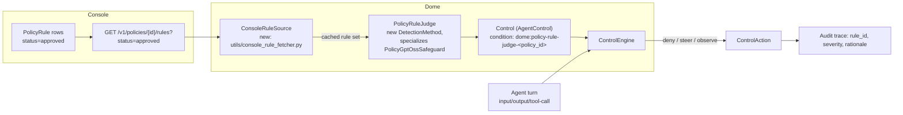

# Policy Enforcement via LLM Judges — Scoping

Status: **Scoping / not yet implemented**
Branch: `design/odrl-policy-enforcement`

## 1. Goal

Console lets a team upload a policy document (privacy policy, acceptable-use policy,
compliance doc, etc.) and extracts it into a set of structured, ODRL-inspired
`PolicyRule` rows (permission / prohibition / obligation / recommendation, each with an
`action`, `target`, `constraints`, and a `consequence` of `block` / `warn` / `log` /
`flag` / `escalate` at some `severity`). Rules go through a human review workflow
(`draft` → `approved` / `rejected` / `modified`).

Today those approved rules are only consumed **offline**: a custom harness can be
generated from a policy's approved rules and evaluated after the fact. There is no
**online** path — nothing stops an agent, in production, from violating a rule the
moment it's approved.

This doc scopes what it would take to close that gap: let Dome fetch a policy's
approved rules from Console and enforce them on live traffic, in real time, using an
LLM as the compliance judge (since the rules are natural-language and not mechanically
checkable), wired into Dome's existing `AgentControl` pipeline so the same control
surface used for guardrails today (deny / steer / observe) also covers "did this turn
violate rule PRIV-003."

## 2. Why an LLM judge, not Cedar/Rego transpilation

Console's `PolicyRule` docstring already says the ODRL-inspired schema is meant "to
serve as an intermediate representation for downstream transpilation to Cedar/Rego for
runtime policy evaluation" (`src/domains/policies/models.py` in vijil-console). We
looked for that compiler and it doesn't exist — and for good reason. Rules are
extracted by an LLM from free-text policy documents (`natural_language` is the only
field guaranteed to be faithful; `action`/`target`/`constraints` are the LLM's
best-effort structuring of that text). Compiling "don't share a user's health
information with third parties without consent" into a sound Cedar/Rego constraint is
either lossy or requires a human to hand-author the formal version — which is exactly
what Console's *separate* `dome_spec` feature is for (see §3.3). Trying to resurrect an
ODRL→Cedar/Rego compiler for LLM-extracted rules was already looked at and
deprioritized elsewhere in this repo as "lossy ... shouldn't gate the demo"
(`docs/trust/2026-06-04-tamper-evident-identity-mac-plan.md:25`).

The pragmatic path is the one Dome already has infrastructure for: ask an LLM "does
this turn violate this rule" per rule, with the rule's natural-language text and
structured metadata as context, and treat the LLM's verdict as the sensor reading.

## 3. What already exists (confirmed by reading both repos, not assumed)

### 3.1 Console: policy rules

- `PolicyRule` (`src/domains/policies/models.py`): `rule_id` (human string like
  `PRIV-001`), `rule_type` (permission/prohibition/obligation/recommendation),
  `action`, `target`, `assignee`, `constraints` + `constraint_logic`, `consequence`
  (`{action: block|warn|log|flag|escalate, severity: info|low|medium|high|critical,
  message}`), `natural_language`, `category`, `status`.
- `GET /v1/policies/{policy_id}/rules?status=approved&limit=&offset=`
  (`src/service_agent_environment/api/policies.py:464`) — exactly the endpoint a Dome
  fetcher would poll. Already consumed client-side by `vijil-sdk`'s
  `policies.rules()`.
- `GET/PATCH/DELETE /v1/rules/{rule_id}`, `POST /v1/rules/{rule_id}/{approve,reject}`
  (`src/service_agent_environment/api/rules.py`) for single-rule lifecycle.
- Service-to-service auth: `(client_id, client_secret)` → `POST /v1/auth/token`
  (`src/service_teams/api/auth.py:511`) — the same client-credentials exchange already
  used elsewhere for machine callers (SDK, CI, and Console's own `dome_spec` →
  Dome-side fetch design).

### 3.2 Dome: AgentControl spec — the thing we'd plug into

- `Control` / `ConditionNode` / `EvaluatorRef` / `ControlAction` (`vijil_dome/controls/models.py`):
  a `Control` has a `scope` (which steps it applies to), a `condition` (a boolean tree
  of evaluator leaves), and an `action` (`decision: deny|steer|observe`,
  `on_error: fail_open|fail_closed`).
- Evaluators are pluggable: `@register_evaluator("name")` on an `Evaluator` subclass
  (`async def evaluate(value, config) -> EvaluatorResult`), resolved by
  `controls/evaluators/__init__.py`. Critically, **any existing Dome `DetectionMethod`
  is already exposed to this layer for free** via the `dome:` prefix bridge
  (`DomeBridgeEvaluator`, `controls/evaluators/dome_bridge.py`) — register something as
  a Dome detector and the control schema can reference it as `dome:<method-name>`
  immediately, no changes to `controls/models.py` or the engine required.

### 3.3 Dome: `trust/` module — related but not this

`vijil_dome/trust/` (policy.py, constraints.py, manifest.py, runtime.py) is a
**separate, already-shipping system**: deterministic MAC-style tool-call permissions
keyed on SPIFFE identity + Ed25519-signed manifests. It calls into Dome's existing
`guard_input`/`guard_output` for *content* guards via `AgentConstraints.dome_config`,
but has no rule-engine or LLM-judge concept of its own — it's a consumer of Dome's
guard system, not an alternative to it. Relevant because it already shows the pattern
for wiring a new Dome detector into a higher-level "constraints for this agent" object
(`dome_config`), which we'd want this new policy-judge control to also be reachable
from, but it is not where this work lives.

Also worth noting: Console has a **separate, already-built `dome_spec` feature**
(`src/domains/dome_spec/` in vijil-console, currently uncommitted on
`fix/frameworks-trust-report-type`) for uploading a hand-authored, pre-compiled Dome
control YAML (controls + sensors + norms, with Cedar/Rego inlined) and attaching it
1:1 to a Policy. That's the path for policies that already have a formal,
machine-checkable representation. This scoping doc is about the *other* case — the
common one — where the policy only exists as LLM-extracted natural-language
`PolicyRule` rows with no formal representation, and the "compiler" is an LLM judge
instead of Cedar/Rego.

### 3.4 Dome: an LLM-judge-over-free-text-policy detector basically already exists

- `PolicyGptOssSafeguard` (`vijil_dome/detectors/methods/gpt_oss_safeguard_policy.py`),
  registered as Dome `DetectionMethod` `"policy-gpt-oss-safeguard"`. Takes free-text
  policy content, builds a hardened classifier system prompt, calls
  `openai/gpt-oss-safeguard-20b` or `-120b` via litellm (default hub **groq** — the same
  model family Console already defaults to for rule extraction,
  `VIJIL_RULES_MODEL=groq/openai/gpt-oss-120b`), at `temperature=0`. Has three output
  modes, the richest of which (`with_rationale`) already returns
  `{"violation", "policy_category", "rule_ids", "confidence", "rationale"}` — i.e. the
  shape we want, just not yet tied to Console's actual `rule_id`s.
- `PolicySectionsDetector` (`vijil_dome/detectors/methods/policy_sections_detector.py`)
  chunks a long policy into sections, runs one judge per section in parallel with
  fast-fail on first violation, with optional FAISS top-k retrieval to only check
  relevant sections against the current turn.
- `LlmBaseDetector` (`vijil_dome/detectors/utils/llm_api_base.py`) is the reusable
  provider abstraction (groq/openai/together hubs via litellm) both of the above sit
  on.

This means the net-new judge detector is a **specialization**, not new infrastructure:
swap "one blob of policy text" for "N structured `PolicyRule` objects fetched from
Console," and swap the section-chunking batcher for a rule-batcher.

### 3.5 Confirmed gap: no Console fetcher exists in `vijil-dome`

Grepped the whole repo case-insensitively for "console" — nothing fetches policy
*content* from Console today. (A prior memory describing a `console_fetcher.py` /
`ConsolePolicySource` refers to `vijil-dome-private`, a different repo the user
explicitly asked not to use here.) This is net-new, not a port.

## 4. Proposed architecture

## 5. Net-new work

### A. `ConsoleRuleSource` — rule fetcher (new)

`vijil_dome/utils/console_rule_fetcher.py`. Given `(policy_id, client_id,
client_secret, console_url)`: exchanges for a JWT via `/v1/auth/token`, calls `GET
/v1/policies/{policy_id}/rules?status=approved`, caches in memory/disk. The list
endpoint has no ETag today (unlike `dome_spec`'s single-file `GET .../content`), so
staleness detection needs either (a) a cheap polling interval (e.g. refresh every N
minutes, matching `dome.refresh_policy()`'s existing manual-refresh UX for the
`dome_spec` path), or (b) a small Console-side addition: surface `policy.updated_at` /
`rules_count` on a lightweight metadata endpoint so Dome can cheaply check "did
anything change" before paying for a full rule fetch. Recommend (b) as a fast follow,
(a) for MVP.

### B. `PolicyRuleJudge` — the judge detector (new, specializes existing code)

New Dome `DetectionMethod`, e.g. `"policy-rule-judge"`, built on `LlmBaseDetector`
exactly like `PolicyGptOssSafeguard`. Config: `policy_id` (+ Console credentials, or a
pre-fetched rule set from `ConsoleRuleSource`). Per invocation: build one prompt
listing each approved rule's `rule_id`, `rule_type`, `natural_language`, `action`,
`target`; ask the model to return, per `rule_id`, `{violated: bool, confidence: float,
rationale: str}`; batch rules the same way `PolicySectionsDetector` batches sections
(parallel chunks with fast-fail) if the rule count is large enough to threaten context
limits. Model default: **groq / `openai/gpt-oss-safeguard-120b`**, matching the
existing `PolicyGptOssSafeguard` default and Console's own `VIJIL_RULES_MODEL` default
— but see open question on "Jev" below.

### C. Wiring into `AgentControl` and deciding what happens on a violation

Because the `dome:` bridge already exposes any `DetectionMethod` to the control schema
for free, this needs **no changes to `controls/models.py` or `controls/engine.py`**.
What needs a decision is the *aggregation* from "N rules, each with its own
`consequence.action`" down to the one `ControlAction.decision` a `Control` emits per
invocation (today's evaluator contract is one `EvaluatorResult` in, one decision out).

Recommended shape: run the judge once per policy per turn (not once per rule — that's
N LLM calls), get back the full per-rule verdict list, and author **one `Control` per
`consequence.action` bucket**, each scoped to the same evaluator call but filtering
which rules count toward its own verdict:

- A `block`-bucket control → `decision: deny`, `on_error: fail_closed` (unless a
  verdict is missing/erroring and you'd rather fail open for availability — TBD).
- `warn` / `flag`-bucket control → `decision: steer` or `observe` with the rule's
  `message`/rationale as `steering_context`.
- `log`-bucket → `observe` only, routed to audit.
- `escalate` — no existing `ControlAction.decision` maps cleanly to "escalate to a
  human"; either reuse `observe` + a higher-severity audit tag, or this is where a
  small `controls/models.py` addition might actually be warranted (open question).

This keeps the "one evaluator call → one decision" invariant the engine already
assumes, at the cost of running the same judge call once per bucket-control that's
active for a given turn — fine as long as the judge result is cached per-turn across
the buckets (single eval, multiple controls reading the cached `EvaluatorResult`).

### D. Traceability

Each violation verdict should carry Console's real `rule_id` (not an invented one)
through to Dome's audit/trace output (`trust/guard.py`'s `EnforcementResult`,
and/or whatever the plain non-trust `VijilDome.guard_input/output` trace already
carries) so Console's reporting can eventually show "blocked because of rule
PRIV-003, severity critical." Full write-back into Console (a "violations" log) is out
of scope for this doc — flagging as a natural follow-on, not required for MVP.

### E. Evaluation-side linkage

The user's ask also mentioned linking policies to evaluations, not just enforcement.
That's largely **already covered**: Console's existing rule-driven custom-harness
generation (approved rules → generated test harness) is the evaluation-side story.
Nothing new is needed there for this scoping pass beyond making sure the same
`PolicyRuleJudge` detector (or at least its prompt-construction logic) is reusable as a
scoring function inside a harness run, not just as a live `Control`, so "did this
transcript violate rule X" is computed identically whether it's asked live or after the
fact.

## 6. Open questions

1. **Judge model** — user said "maybe Jev for now"; best-guess mapping based on what
   already exists in this repo and in Console is `gpt-oss-safeguard` via Groq (same
   family `PolicyGptOssSafeguard` and Console's `VIJIL_RULES_MODEL` already default
   to). Needs confirmation — "Jev" doesn't match anything found in either repo.
2. Polling vs. push for rule freshness in Dome (§4A) — acceptable to start with a fixed
   poll interval, or does Console need a cheap staleness-check endpoint first?
3. Bucket-per-`consequence.action` control authoring (§4C) — acceptable, or do we want
   a real engine-level "fan out to multiple actions from one evaluator call" primitive
   instead of asking callers to author N controls?
4. `escalate` consequence has no existing `ControlAction.decision` equivalent — new
   decision type, or map onto `observe` + audit severity for now?
5. Who provisions the `(client_id, client_secret)` Dome uses to call Console in a live
   deployment, and where do they live (expect: same AWS Secrets Manager pattern already
   used for `vijil-policy-rules-agent`'s LLM keys)?
6. Should enforcement verdicts write back to Console at all for MVP, or is Dome's own
   audit trail sufficient until there's a concrete reporting consumer?

## 7. Suggested phasing

- **MVP**: `ConsoleRuleSource` (poll-based) + `PolicyRuleJudge` detector (single batch,
  no RAG) + one `block`-bucket `Control` + one `warn/flag`-bucket `Control`, wired via
  the existing `dome:` bridge. Fixed judge model (pending open question 1).
  No Console write-back; audit via existing trace output.
- **Fast follow**: `log`/`escalate` buckets, rule-count-aware batching
  (`PolicySectionsDetector`-style fast-fail) for policies with many rules, Console
  staleness-check endpoint to replace fixed polling, write-back of violations to
  Console telemetry.
- **Later**: reuse the same judge as an evaluation-time scorer (not just a live
  `Control`), unifying the enforcement and evaluation code paths.
