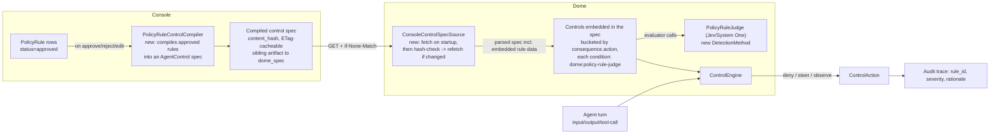

# Policy Enforcement via LLM Judges — Scoping

Status: **Scoping / not yet implemented**
Branch: `design/odrl-policy-enforcement`

## 1. Goal

Console lets a team upload a policy document (privacy policy, acceptable-use policy,
compliance doc, etc.) and extracts it into a set of structured, ODRL-inspired
`PolicyRule` rows (permission / prohibition / obligation / recommendation, each with an
`action`, `target`, `constraints`, and a `consequence` of `block` / `warn` / `log` /
`flag` / `escalate` at some `severity`). Rules go through a human review workflow
(`draft` → `approved` / `rejected` / `modified`).

Today those approved rules are only consumed **offline**: a custom harness can be
generated from a policy's approved rules and evaluated after the fact. There is no
**online** path — nothing stops an agent, in production, from violating a rule the
moment it's approved.

This doc scopes what it would take to close that gap: let Dome fetch a policy's
approved rules from Console and enforce them on live traffic, in real time, using an
LLM as the compliance judge (since the rules are natural-language and not mechanically
checkable), wired into Dome's existing `AgentControl` pipeline so the same control
surface used for guardrails today (deny / steer / observe) also covers "did this turn
violate rule PRIV-003."

## 2. Why an LLM judge, not Cedar/Rego transpilation

Console's `PolicyRule` docstring already says the ODRL-inspired schema is meant "to
serve as an intermediate representation for downstream transpilation to Cedar/Rego for
runtime policy evaluation" (`src/domains/policies/models.py` in vijil-console). We
looked for that compiler and it doesn't exist — and for good reason. Rules are
extracted by an LLM from free-text policy documents (`natural_language` is the only
field guaranteed to be faithful; `action`/`target`/`constraints` are the LLM's
best-effort structuring of that text). Compiling "don't share a user's health
information with third parties without consent" into a sound Cedar/Rego constraint is
either lossy or requires a human to hand-author the formal version — which is exactly
what Console's *separate* `dome_spec` feature is for (see §3.3). Trying to resurrect an
ODRL→Cedar/Rego compiler for LLM-extracted rules was already looked at and
deprioritized elsewhere in this repo as "lossy ... shouldn't gate the demo"
(`docs/trust/2026-06-04-tamper-evident-identity-mac-plan.md:25`).

The pragmatic path is the one Dome already has infrastructure for: ask an LLM "does
this turn violate this rule" per rule, with the rule's natural-language text and
structured metadata as context, and treat the LLM's verdict as the sensor reading.

## 3. What already exists (confirmed by reading both repos, not assumed)

### 3.1 Console: policy rules

- `PolicyRule` (`src/domains/policies/models.py`): `rule_id` (human string like
  `PRIV-001`), `rule_type` (permission/prohibition/obligation/recommendation),
  `action`, `target`, `assignee`, `constraints` + `constraint_logic`, `consequence`
  (`{action: block|warn|log|flag|escalate, severity: info|low|medium|high|critical,
  message}`), `natural_language`, `category`, `status`.
- `GET /v1/policies/{policy_id}/rules?status=approved&limit=&offset=`
  (`src/service_agent_environment/api/policies.py:464`) — exactly the endpoint a Dome
  fetcher would poll. Already consumed client-side by `vijil-sdk`'s
  `policies.rules()`.
- `GET/PATCH/DELETE /v1/rules/{rule_id}`, `POST /v1/rules/{rule_id}/{approve,reject}`
  (`src/service_agent_environment/api/rules.py`) for single-rule lifecycle.
- Service-to-service auth: `(client_id, client_secret)` → `POST /v1/auth/token`
  (`src/service_teams/api/auth.py:511`) — the same client-credentials exchange already
  used elsewhere for machine callers (SDK, CI, and Console's own `dome_spec` →
  Dome-side fetch design).

### 3.2 Dome: AgentControl spec — the thing we'd plug into

- `Control` / `ConditionNode` / `EvaluatorRef` / `ControlAction` (`vijil_dome/controls/models.py`):
  a `Control` has a `scope` (which steps it applies to), a `condition` (a boolean tree
  of evaluator leaves), and an `action` (`decision: deny|steer|observe`,
  `on_error: fail_open|fail_closed`).
- Evaluators are pluggable: `@register_evaluator("name")` on an `Evaluator` subclass
  (`async def evaluate(value, config) -> EvaluatorResult`), resolved by
  `controls/evaluators/__init__.py`. Critically, **any existing Dome `DetectionMethod`
  is already exposed to this layer for free** via the `dome:` prefix bridge
  (`DomeBridgeEvaluator`, `controls/evaluators/dome_bridge.py`) — register something as
  a Dome detector and the control schema can reference it as `dome:<method-name>`
  immediately, no changes to `controls/models.py` or the engine required.

### 3.3 Dome: `trust/` module — related but not this

`vijil_dome/trust/` (policy.py, constraints.py, manifest.py, runtime.py) is a
**separate, already-shipping system**: deterministic MAC-style tool-call permissions
keyed on SPIFFE identity + Ed25519-signed manifests. It calls into Dome's existing
`guard_input`/`guard_output` for *content* guards via `AgentConstraints.dome_config`,
but has no rule-engine or LLM-judge concept of its own — it's a consumer of Dome's
guard system, not an alternative to it. Relevant because it already shows the pattern
for wiring a new Dome detector into a higher-level "constraints for this agent" object
(`dome_config`), which we'd want this new policy-judge control to also be reachable
from, but it is not where this work lives.

Also worth noting: Console has a **separate, already-built `dome_spec` feature**
(`src/domains/dome_spec/` in vijil-console, currently uncommitted on
`fix/frameworks-trust-report-type`) for uploading a hand-authored, pre-compiled Dome
control YAML (controls + sensors + norms, with Cedar/Rego inlined) and attaching it
1:1 to a Policy. That's the path for policies that already have a formal,
machine-checkable representation. This scoping doc is about the *other* case — the
common one — where the policy only exists as LLM-extracted natural-language
`PolicyRule` rows with no formal representation, and the "compiler" is an LLM judge
instead of Cedar/Rego.

### 3.4 Dome: an LLM-judge-over-free-text-policy detector basically already exists

- `PolicyGptOssSafeguard` (`vijil_dome/detectors/methods/gpt_oss_safeguard_policy.py`),
  registered as Dome `DetectionMethod` `"policy-gpt-oss-safeguard"`. Takes free-text
  policy content, builds a hardened classifier system prompt, calls
  `openai/gpt-oss-safeguard-20b` or `-120b` via litellm (default hub **groq** — the same
  model family Console already defaults to for rule extraction,
  `VIJIL_RULES_MODEL=groq/openai/gpt-oss-120b`), at `temperature=0`. Has three output
  modes, the richest of which (`with_rationale`) already returns
  `{"violation", "policy_category", "rule_ids", "confidence", "rationale"}` — i.e. the
  shape we want, just not yet tied to Console's actual `rule_id`s.
- `PolicySectionsDetector` (`vijil_dome/detectors/methods/policy_sections_detector.py`)
  chunks a long policy into sections, runs one judge per section in parallel with
  fast-fail on first violation, with optional FAISS top-k retrieval to only check
  relevant sections against the current turn.
- `LlmBaseDetector` (`vijil_dome/detectors/utils/llm_api_base.py`) is the reusable
  provider abstraction (groq/openai/together hubs via litellm) both of the above sit
  on.

This means the net-new judge detector is a **specialization**, not new infrastructure:
swap "one blob of policy text" for "N structured `PolicyRule` objects fetched from
Console," and swap the section-chunking batcher for a rule-batcher.

### 3.5 Confirmed gap: no Console fetcher exists in `vijil-dome`

Grepped the whole repo case-insensitively for "console" — nothing fetches policy
*content* from Console today. (A prior memory describing a `console_fetcher.py` /
`ConsolePolicySource` refers to `vijil-dome-private`, a different repo the user
explicitly asked not to use here.) This is net-new, not a port.

### 3.6 Judge model: Jev / TypeSafe System One

User-specified model, via OpenRouter: `typesafe/jev-1.13`
(https://openrouter.ai/typesafe/jev-1.13), docs at
https://docs.typesafe.ai/concepts/system-one. `OPENROUTER_API_KEY` goes in Dome's
`.env`, same convention as `GROQ_API_KEY`/`TOGETHERAI_API_KEY` today.

This is **not** a general chat model — it's TypeSafe's "System One" decision layer,
which returns typed, calibrated decisions instead of generated text, via three
primitives: **Choice** (pick from options), **Score** (numeric scale), **Noul**
(boolean probability). The intended pattern is: build a "state" with context, pose
multiple independent questions against it, get back typed answers with calibrated
confidence. That maps onto our problem almost exactly — "did this turn violate rule
PRIV-003" is a **Noul** question, one per approved rule, posed together against the
same turn-as-state in a single call, with the rule's `severity`/confidence handled as
a **Score**. That's a cleaner fit than `PolicyGptOssSafeguard`'s current approach
(prompt-engineered JSON + regex-fallback parsing of a chat completion) for exactly the
"N structured rules → N verdicts" shape this feature needs.

Two open implementation details, not blockers for this scoping pass:
- `vijil_dome/detectors/utils/llm_api_base.py`'s `LlmBaseDetector` only knows
  `supported_hubs = [None, "openai", "together", "groq"]` and calls litellm's standard
  chat-completions path — it has no concept of System One's typed primitives.
  `"openrouter"` isn't in that list yet either.
- TypeSafe's own docs describe a dedicated `POST /v1/systemone` shape (not
  `/chat/completions`). Whether OpenRouter's hosted `typesafe/jev-1.13` exposes that
  typed shape through OpenRouter, or normalizes it to a chat-completions-style
  response that still carries the typed decision in the message, needs a quick check
  against OpenRouter's actual request/response docs for this model before writing the
  client. Recommend a small dedicated `SystemOneClient` (posts a Noul-per-rule batch,
  gets calibrated probabilities back directly) rather than forcing this through
  `LlmBaseDetector`'s generic litellm path — avoids re-adding the JSON-parsing
  fragility we'd otherwise inherit from `PolicyGptOssSafeguard`.

## 4. Proposed architecture

Revised from the first pass of this doc based on a steer: rather than Dome
independently fetching raw `PolicyRule` rows and assembling its own Controls at
runtime, **Console compiles the approved rule set into a single hosted artifact** —
an AgentControl-shaped spec with the judge wiring already baked in — and Dome just
points at that one artifact, cached the same way `dome_spec` already is (fetch once,
then a cheap hash check before re-fetching). This gives us one artifact to consume
from Console instead of two different fetch mechanisms (raw rules + hand-authored
dome_spec).

## 5. Net-new work

### A. Console: `PolicyRuleControlCompiler` + compiled-spec endpoint (new)

A new Console-side service (sibling to `DomeSpecService`, not a change to it — see
rationale below) that takes a policy's approved `PolicyRule` rows and emits an
AgentControl-shaped YAML: one `Control` per `consequence.action` bucket (§5C), each
with the relevant rules' `rule_id`/`rule_type`/`natural_language`/`action`/`target`
embedded directly in the `Control`'s evaluator config, condition pointing at
`dome:policy-rule-judge`. Stored with a `content_hash` the same way `dome_spec`
already computes one, exposed via a sibling endpoint
(`GET /v1/policies/{policy_id}/compiled-control-spec`, supporting `If-None-Match` →
`304` exactly like `dome_spec`'s existing `GET .../content`). Recompiled whenever the
approved rule set changes (rule approved/rejected/edited while approved/deleted) —
this is a server-side trigger, not a user-facing action, so Dome's cached hash is
never stale for longer than the next poll interval.

**Why a sibling artifact and not folding this into `dome_spec`**: `dome_spec` today
is specifically "a human already hand-authored and validated a real Cedar/Rego
control spec, upload it as-is" (`validate_dome_spec_content` rejects file-path
Cedar/Rego references, enforces depth/length limits meant for *human* input). An
auto-compiled, judge-based spec is a different kind of thing — generated, not
uploaded, and should never be silently overwritten by (or silently overwrite) a
hand-authored one for the same policy. Keeping them as two independent, composable
artifacts (both fetchable by Dome, both ETag-cacheable) avoids a product decision we
don't need to force yet: whether/how the two coexist for a single policy.

### B. Dome: `ConsoleControlSpecSource` — compiled-spec fetcher (new)

`vijil_dome/utils/console_control_spec_fetcher.py`, following the same shape as
`dome_spec`'s existing conditional-GET pattern. Per the user's steer: **fetch on Dome
startup** (one `VijilDome(policy=ConsoleControlSpecSource(client_id=..., client_secret=...,
policy_id=...))`-style init, each deployer supplying their own Console credentials and
the policy they want enforced — resolves the "whose credentials" open question from
the first pass of this doc), then a cheap periodic **hash check** (conditional GET,
`304` if unchanged) before paying for a full re-parse — exactly the `dome_spec`
ETag/`content_hash` mechanism already built, reused rather than re-invented.

### C. `PolicyRuleJudge` — the judge detector (new)

New Dome `DetectionMethod`, e.g. `"policy-rule-judge"`, backed by Jev/System One
(§3.6) rather than `LlmBaseDetector`'s generic chat-completions path. Takes the rules
embedded in whichever bucketed `Control` invoked it (no separate Console call needed
at judge time — the compiled spec already carries everything), poses one **Noul**
question per rule ("did this turn violate rule `{rule_id}`: `{natural_language}`?")
batched into a single System One call, gets back calibrated per-rule violation
probabilities directly (no JSON-parsing fallback regex needed, unlike
`PolicyGptOssSafeguard`). Batches rules the same way `PolicySectionsDetector`
batches sections if a policy's approved-rule count threatens context/request limits.

### D. Wiring into `AgentControl` and deciding what happens on a violation

Because the `dome:` bridge already exposes any `DetectionMethod` to the control
schema for free, this needs **no changes to `controls/models.py` or
`controls/engine.py`**. The compiled spec (§5A) is already bucketed by
`consequence.action` at compile time, so each `Control`'s `action.decision` is fixed
at generation time:

- `block` **and** `escalate` → `decision: deny`, `on_error: fail_closed` (per the
  user: escalate is treated as deny for enforcement purposes; it still gets a
  higher-severity audit tag so downstream alerting/reporting can distinguish "routine
  block" from "escalate-worthy block" even though the live decision is the same).
- `warn` / `flag` → `decision: steer` or `observe`, with the rule's
  `message`/rationale as `steering_context`.
- `log` → `observe` only, routed to audit.

This keeps the "one evaluator call → one decision" invariant the engine already
assumes; running the judge once per bucket-control active for a turn is fine as long
as the judge result is cached per-turn across buckets (single Jev call, multiple
controls reading the cached result).

### E. Traceability — via OTel, not a new write-back API

Per a steer from review: violations should trigger *within* Dome and ride Dome's
existing OTel instrumentation back to wherever it's configured to export to, rather
than Dome calling a new Console "report a violation" endpoint. This is much less new
work than it sounds, because the pipe already exists end-to-end:

- `helm_charts/vijil-dome/values/secrets/example.yaml` (in vijil-console) already
  defines exactly this convention for a standalone Dome deployment:
  `ENABLE_DOME_INSTRUMENTATION`, `DOME_{METRICS,TRACES,LOGS}_COLLECTOR_ENDPOINT` +
  `_TOKEN` (pointed at Console's own OTel ingestion, e.g.
  `https://otel.dev05.vijil.ai/v1/traces`), and `AGENT_ID` / `USER_ID` / `TEAM_ID` as
  resource attributes. Console's telemetry query layer
  (`src/domains/telemetry/trace_models.py`) already does tenancy-filtered trace
  search keyed on a verified **`team.id`** resource attribute (see its `CON-433`
  comment) — i.e. "Dome telemetry shows up in Console, scoped to the right team" is
  an already-solved, already-shipping problem for Dome's existing detectors.
- Dome's `_add_darwin_detection_spans` (`vijil_dome/integrations/instrumentation/otel_instrumentation.py`)
  already wraps every `Guardrail.scan`/`async_scan` call in a `dome-detection` span
  with `team.id`/`agent.id`/`user.id` + `detection.label`/`score`/`method` attributes,
  specifically so "Darwin's `TelemetryDetectionAdapter` can query them from Tempo."
  Any detector plugged into an input/output `Guardrail` gets this for free today.

**What's actually missing** for policy violations specifically:

1. `GuardResult`/`GuardrailResult` (`vijil_dome/guardrails/__init__.py`) have a fixed
   schema — `flagged`, `detection_score`, `triggered_methods`, no generic metadata
   dict — so there's nowhere to carry `rule_id`/`policy_id`/`consequence.action` /
   `severity` through `_set_darwin_span_attributes` today. And since we're wiring
   `PolicyRuleJudge` through the **AgentControl** `Control`/`ControlEngine` path (§5D)
   rather than a plain `Guardrail`, to get the deny/steer/observe decision semantics —
   that path currently has **zero OTel span emission at all** (grepped
   `controls/engine.py`/`controls/decorator.py` for `span`/`tracer`/`otel`: nothing).
2. So this needs one small, net-new piece: a `dome-control` span (same shape as
   `dome-detection`, same `_safe_set_attribute` helper from
   `instrumentation/tracing.py`) emitted from `ControlEngine.evaluate()` or the
   `@control` decorator, carrying `control.name`, `control.decision`
   (deny/steer/observe), and — specific to this feature — `policy.id`, `rule.id`,
   `rule.type`, `consequence.action`, `consequence.severity`, plus the existing
   `team.id`/`agent.id`/`user.id`.
3. `POLICY_ID` should join `AGENT_ID`/`TEAM_ID`/`USER_ID` as a resource attribute in
   the same Dome deployment config, so "show me every enforcement decision for this
   policy" is a plain Tempo/trace-search filter, the same way `team.id` already
   enables per-team filtering.

With those two additions, "feed back into Console" is just "point `DOME_TRACES_COLLECTOR_ENDPOINT` at Console's collector, same as any other Dome deployment already does" — no new Console-side ingestion endpoint, no new write-back API, and it's consistent with how every other Dome detection already surfaces in Console today.

### F. Evaluation-side linkage

The user's ask also mentioned linking policies to evaluations, not just enforcement.
That's largely **already covered**: Console's existing rule-driven custom-harness
generation (approved rules → generated test harness) is the evaluation-side story.
Nothing new is needed there for this scoping pass beyond making sure the same
`PolicyRuleJudge` detector (or at least its Noul-question-construction logic) is
reusable as a scoring function inside a harness run, not just as a live `Control`, so
"did this transcript violate rule X" is computed identically whether it's asked live
or after the fact.

## 6. Open questions

Resolved in review (kept here for the record, not re-asking):
judge model → Jev/System One via OpenRouter (§3.6); rule freshness → startup fetch +
hash-check-then-refetch (§5B, reusing `dome_spec`'s ETag mechanism); `escalate` →
`deny` (§5D); Console credentials → supplied per-deployment at Dome init, not shared
(§5B); violation reporting → ride Dome's existing OTel instrumentation back to
Console's already-configured collector, not a new write-back API (§5E).

Still open:

1. **Jev wire format**: does OpenRouter expose System One's typed `/v1/systemone`
   shape for `typesafe/jev-1.13`, or only a chat-completions-normalized response that
   still carries the typed decision in the message body? Needs a check against
   OpenRouter's actual docs for this specific model before writing `SystemOneClient`
   (§3.6) — not a design blocker, just an implementation-time detail.
2. **Compiled-spec vs. hand-authored `dome_spec` coexistence** (§5A): recommending
   they stay two independent, both-fetchable artifacts rather than one overloaded
   `dome_specs` row — confirm that's the right call, since it does mean Dome
   potentially merges two specs for the same policy rather than consuming one.
3. Recompile trigger (§5A) — recommending auto-recompile on any approved-rule-set
   change (approve/reject/edit/delete), computed server-side with no user-facing
   button. Confirm that's sufficient, vs. wanting an explicit "publish" step a policy
   owner controls (so a policy with rules still being reviewed doesn't partially
   enforce mid-review).

## 7. Suggested phasing

- **MVP**: Console's `PolicyRuleControlCompiler` + compiled-spec endpoint (§5A) +
  Dome's `ConsoleControlSpecSource` (§5B, startup fetch + hash-check) +
  `PolicyRuleJudge` on Jev/System One (§5C) + `block`/`escalate`→deny and
  `warn`/`flag`→steer buckets (§5D) + the new `dome-control` OTel span with
  `policy.id`/`rule.id`/`consequence.*` attributes, wired to whichever
  `DOME_TRACES_COLLECTOR_ENDPOINT` the deployment already points at Console with
  (§5E) — no new Console ingestion endpoint needed.
- **Fast follow**: `log` bucket, rule-count-aware batching
  (`PolicySectionsDetector`-style fast-fail) for policies with many rules, a Console
  UI surface for querying enforcement spans by `policy.id` (the query-side equivalent
  of what Darwin already does for `team.id`-scoped detection spans).
- **Later**: reuse the same judge as an evaluation-time scorer (not just a live
  `Control`), unifying the enforcement and evaluation code paths.
