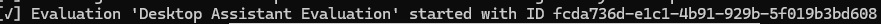

# Tutorial - Autotuned Guardrails 

This folder contains the code to follow along with our blog post on generating recommended Dome configurations from Vijil Trust evaluations. 

## Setup
Check out the contents of this folder and set up a new virtual environment. 

```bash
python -m venv dome-tutorials
python -m pip install -r requirements.txt
```

Next, create a new .env file with the following environment variables
```
OPENAI_API_KEY = <Your OpenAI key>
VIJIL_API_KEY = <Your Vijil API key>
```

You can obtain a Vijil API key by signing up on evaluate.vijil.ai, and [following these instructions](https://docs.vijil.ai/setup.html#authentication-using-api-keys). 

If you're not a premium user of Vijil, you'll need to obtain an [Ngrok Authtoken](https://dashboard.ngrok.com/get-started/setup/pythonhttps://dashboard.ngrok.com/get-started/setup/python) as well.  We use Ngrok to create private, protected HTTPS endpoints to your agent. If you’re on a Free plan, you’ll need to get an Ngrok authorization token. If you’re subscribed to the premium version of Vijil, you don’t need to worry about this - we take care of it for you.
```
NGROK_AUTHTOKEN = <Your Ngrok authtoken>
```

## Step 1 - Evaluating the agent
In order to create a dome configuration from an evaluation, we first need to evaluate our agent. Simply run 

```bash
python -m evaluate_baseline_agent
```

to evaluate the standard, unprotected agent. This will run safety and security tests on the agent, in an evaluation called "Desktop Assistant Evaluation" and may take a few minutes.
Once the evaluation is complete, make a note of the evaluation ID. You can find it in the output logs of the evaluation, or by navigating to evaluate.vijil.ai, and copying the evaluation ID of the appropriate evaluation. If you ran the script without changing it, the name of the evaluation would be "Desktop Assistant Evaluation".



## Step 2 - Evaluating the protected agent
Creating a dome configuration from an evaluation is incredibly easy, and only takes three lines of code
```python
dome = Dome.create_from_vijil_evaluation(
    evaluation_id=YOUR_EVALUATION_ID,
    api_key=VIJIL_API_KEY,
)
```

To run an evaluation on a guarded agent, you can run 

```bash
python -m evaluate_protected_agent --evaluation-id=YOUR_EVALUATION_ID
```
where YOUR_EVALUATION_ID was the evaluation ID you obtained from step 1. 

## Step 3 - Optimizing for Latency

You can specify a latency threshold when running `evaluate_protected_agent` in order to obtain guardrails that are optimized for your latency requirements. Note that the latency threshold is specified in seconds. 
```bash
python -m evaluate_protected_agent --evaluation-id=YOUR_EVALUATION_ID --latency-threshold=1.0
```


## Troubleshooting
- Some Windows antivirus solutions flag Ngrok as a virus. Ngrok is safe, trusted and [not a virus](https://ngrok.com/docs/faq/#is-ngrok-a-virus). Additionally, when using Ngrok we guarantee that any traffic that reaches your agent is from our services, so we can guarantee that your agent is not publicly exposed. 
